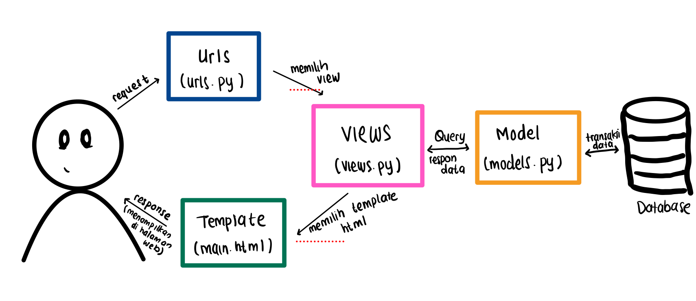
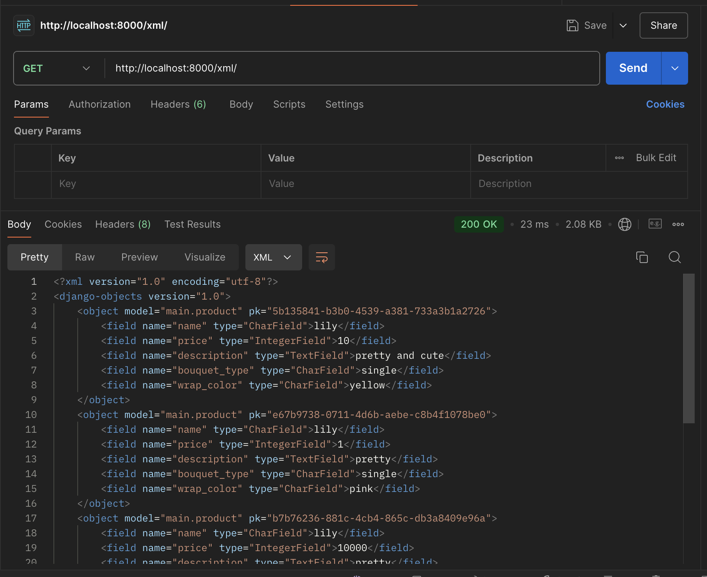
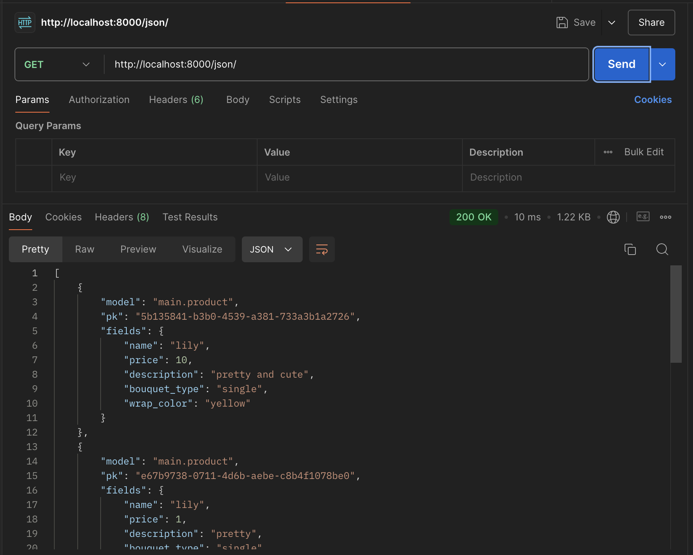
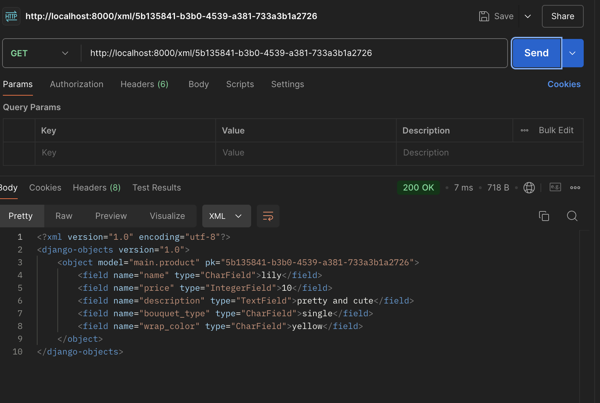

# Peonies Site
Welcome to Peonies Site, your one-stop shop for fresh, beautiful flowers!

[Peonies Site Website](http://rizki-amani-peoniessite.pbp.cs.ui.ac.id)

## Daftar Tugas:
- **[Tugas 2](#tugas-2)**<br>
- **[Tugas 3](#tugas-3)**<br>
- **[Tugas 4](#tugas-4)**<br>
- **[Tugas 5](#tugas-5)**<br>


## Tugas 2

### 1. Jelaskan bagaimana cara kamu mengimplementasikan checklist di atas secara step-by-step (bukan hanya sekadar mengikuti tutorial)

1. **Membuat Proyek Django Baru:**
    - Membuat direktori baru yang sesuai dengan nama aplikasi, peonies-site
    - Aktifkan virtual environment
    - Buat proyek baru dengan perintah: `django-admin startproject`

2. **Membuat Aplikasi:**
    - Buat aplikasi baru dengan perintah `python3 manage.py startapp main`
    - Menamakannya dengan main sesuai perintah tugas

3. **Melakukan routing pada proyek:**
    - Tambahkan aplikasi `main` ke dalam `INSTALLED_APPS` di `settings.py` proyek:
     ```python
     INSTALLED_APPS = [
         ...
         'main',
     ]
     ```

    - Konfigurasikan routing dengan menambahkan `main.urls` ke `urls.py` proyek:
     ```python
     from django.contrib import admin
     from django.urls import path, include

     urlpatterns = [
         path('admin/', admin.site.urls),
         path('', include('main.urls')),
     ]
     ```
4. **Membuat Models:**
    - Mendefinisikan model pada `models.py` yang sesuai dengan aplikasi.
     ```python
    from django.db import models

    class Product(models.Model):
        BOUQUET_TYPE_CHOICES = [
            ('single', 'Single'),
            ('small', 'Small'),
            ('medium', 'Medium'),
            ('big', 'Big')
        ]

        name = models.CharField(max_length=255)
        price = models.IntegerField()
        description = models.TextField()
        bouquet_type = models.CharField(max_length=10, choices=BOUQUET_TYPE_CHOICES, default='single')  # Type of bouquet
        wrap_color = models.CharField(max_length=50, default='')  # Wrap color

        def __str__(self):
            return self.name
        
        @property
        def is_in_stock(self):
            return self.stock > 0
     ```
    - Jalankan migrasi untuk membuat tabel `Product` di database, menggunakan perintah `python manage.py makemigrations` dan `python manae.py migrate`

5. **Membuat Fungsi pada Views dan Template HTML:**
    - Tambahkan fungsi pada `views.py` di aplikasi `main`:
     ```python
    from django.shortcuts import render
    from .models import Product

    def product_list(request):
        context = {
            'name': 'Rizki Amani Hasanah',  
            'npm': '2306213376', 
            'class_name': 'PBP B',  
            'app_name': 'Peonies Site'
        }

        return render(request, 'main.html', context)
     ```
    - Lalu membuat html yang sesuai dengan keinginan

6. **Routing pada urls.py Aplikasi Main:**
   - Tambahkan konfigurasi routing pada `urls.py` aplikasi `main`:
     ```python
    from django.urls import path
    from . import views

    urlpatterns = [
        path('', views.product_list, name='main'),
    ]
     ```

7. **Deployment ke PWS:**
   - Gunakan `python manage.py runserver` untuk pengujian pada server lokal
   - Memasukkan url pws di `settings.py`, tepatnya ALLOWED_HOSTS
   - Deploy aplikasi ke platform hosting PWS 

### 2. Buatlah bagan yang berisi request client ke web aplikasi berbasis Django beserta responnya dan jelaskan pada bagan tersebut kaitan antara urls.py, views.py, models.py, dan berkas html.



- **urls.py**: Mengarahkan URL dari client ke fungsi yang sesuai di `views.py`.
- **views.py**: Menangani logika bisnis dan memproses data, termasuk mengambil data dari model (jika diperlukan) dan mengirimkan ke template.
- **models.py**: Mengelola interaksi dengan database (misalnya, mengambil atau menyimpan data).
- **Template HTML**: Menyediakan format tampilan yang dikirimkan sebagai respon ke client.

### 3. Jelaskan fungsi git dalam pengembangan perangkat lunak!
Git adalah sistem kontrol versi terdistribusi yang memungkinkan pengembang untuk mengelola perubahan dalam kode sumber proyek perangkat lunak. Fungsinya meliputi melacak perubahan dengan menyimpan riwayat dalam repositori, sehingga bisa kembali ke versi sebelumnya jika diperlukan. Selain itu, Git memfasilitasi kolaborasi tim dengan mengelola perubahan yang dilakukan oleh beberapa pengembang secara bersamaan melalui cabang (branches) dan merge. Git juga berfungsi sebagai cadangan kode, memungkinkan pemulihan jika terjadi masalah dengan menyimpan salinan kode yang dikendalikan oleh sistem.

### 4. Menurut Anda, dari semua framework yang ada, mengapa framework Django dijadikan permulaan pembelajaran pengembangan perangkat lunak?
Django sering dipilih sebagai framework pemula karena beberapa alasan:
- **Kemudahan Penggunaan:** Django memiliki dokumentasi yang lengkap dan komunitas yang aktif
- **Batteries Included:** Django menyediakan banyak fitur bawaan yang memudahkan pengembangan aplikasi web, seperti ORM, sistem autentikasi, dan admin interface.
- **Struktur yang Jelas:** Django mengikuti pola desain Model-View-Template (MVT) yang memisahkan logika aplikasi dari presentasi

### 5. Mengapa model pada Django disebut sebagai ORM?
Model pada Django disebut sebagai ORM (Object-Relational Mapping) karena menyediakan cara untuk berinteraksi dengan database menggunakan objek Python daripada menulis query SQL secara langsung. ORM memungkinkan pemetaan antara kelas Python dan tabel database, membuat pengembangan lebih intuitif dan mengurangi kebutuhan untuk penulisan query SQL yang rumit.


## Tugas 3

### 1. Mengapa Kita Memerlukan Data Delivery dalam Pengimplementasian Sebuah Platform?
Data delivery diperlukan untuk mentransfer informasi antar sistem atau antar bagian dalam suatu platform, sehingga memungkinkan komunikasi yang efektif antara backend dan frontend atau antar aplikasi yang berbeda. Pada pengembangan suatu platform, data delivery akan memastikan bahwa informasi dapat "dipertukarkan" dengan cara yang terstruktur dan juga konsisten. Hal ini penting terutama dalam aplikasi yang membutuhkan integrasi berbagai komponen atau layanan, seperti API, supaya pengguna bisa menerima data yang relevan dengan cepat dan aman.

### 2. Menurutmu, Mana yang Lebih Baik antara XML dan JSON? Mengapa JSON Lebih Populer Dibandingkan XML?
Menurut aku, JSON lebih baik berdasarkan alasan yang aku pahami: 
- Mudah dibaca: JSON lebih ringkas dan lebih mudah dipahami oleh manusia dibandingkan XML yang memiliki tag yang lebih panjang.
- Dukungan di penggunaan bahasa pemrograman: JSON lebih mudah diintegrasikan di sebagian besar bahasa pemrograman modern, termasuk JavaScript dan Python, karena formatnya menyerupai struktur objek pada bahasa tersebut.
- Efisiensi: JSON lebih ringan dibandingkan XML dalam hal ukuran data yang dikirim, sehingga lebih cepat di jaringan dan lebih hemat bandwidth.

Dari apa yang aku baca, JSON lebih "populer" karena alasan-alasan di atas, terutama dalam konteks aplikasi web dan API modern di mana kecepatan dan efisiensi sangat penting. Namun, XML sendiri masih digunakan dalam aplikasi tertentu yang membutuhkan skema data yang lebih kompleks atau validasi yang ketat.

### 3. Jelaskan Fungsi dari Method is_valid() pada Form Django dan Mengapa Kita Membutuhkan Method Tersebut?
Method `is_valid()` pada form Django digunakan untuk memvalidasi data yang di-input oleh pengguna sebelum data tersebut diproses atau disimpan ke dalam database. Fungsi ini akan memeriksa apakah semua field yang diisikan sesuai dengan aturan yang telah ditentukan pada form, seperti validasi tipe data, batasan panjang karakter, dan apakah field tersebut wajib diisi atau tidak. Jika data valid, method ini akan mengembalikan nilai True, dan jika tidak valid, method ini akan mengembalikan nilai False serta menampilkan pesan kesalahan secara otomatis.

Alasan mengapa kita membutuhkan `is_valid()` adalah untuk memastikan bahwa data yang di-input pengguna sesuai dengan harapan, sehingga mencegah kesalahan atau kerusakan data pada database serta memberikan feedback yang tepat kepada pengguna jika terdapat kesalahan.

### 4. Mengapa Kita Membutuhkan csrf_token Saat Membuat Form di Django? Apa yang Dapat Terjadi Jika Kita Tidak Menambahkan csrf_token Pada Form Django? Bagaimana Hal Tersebut Dapat Dimanfaatkan oleh Penyerang?
`csrf_token` menjadi token keamanan yang digunakan untuk melindungi aplikasi dari serangan Cross-Site Request Forgery (CSRF). Saat membuat form di Django, csrf_token memastikan bahwa setiap request yang dikirim berasal dari pengguna yang sah dan tidak dimanipulasi oleh pihak ketiga. Jika implementasi tanpa csrf_token, penyerang dapat memanfaatkan celah ini untuk melakukan tindakan yang tidak sah (seperti mengirim form atau memodifikasi data).

Jika tidak menggunakan csrf_token, aplikasi menjadi rentan terhadap serangan CSRF, di mana penyerang dapat membuat pengguna mengirim request tanpa disadari. Hal ini dapat dimanfaatkan oleh penyerang untuk mengubah data, membuat transaksi palsu, atau bahkan menjalankan aksi berbahaya lainnya atas nama pengguna yang sah.

### 5. Jelaskan Bagaimana Cara Kamu Mengimplementasikan Checklist di Atas Secara Step-by-Step (Bukan Hanya Sekadar Mengikuti Tutorial)?
Berikut adalah langkah-langkah yang saya lakukan dalam mengimplementasikan checklist pada proyek ini:
1. **Implementasi Skeleton dan UUID:**
 Langkah ini memang tidak diwajibkan, namun saya tetap mengimplementasikan supaya bisa lebih terbiasa dan mendafaptakn benefit nya.

2. **Membuat Model:**
 Saya memulai dengan membuat model untuk menyimpan data yang diperlukan, dan saya namakan sebagai Product. Saya menentukan field apa saja yang dibutuhkan serta tipe datanya.

3. **Membuat Form**: 
 Selanjutnya, saya membuat form berbasis model (ModelForm) untuk menerima input pengguna terkait produk yang akan ditambahkan.

4. **Membuat Views:**
 Saya menambahkan fungsi view yang meng-handle form, menggunakan method `is_valid()` untuk memvalidasi data yang masuk. Jika data valid, saya menyimpan data tersebut ke dalam database dan melakukan redirect ke halaman utama.

5. **Menambahkan URL Patterns:**
 Saya menambahkan URL pattern untuk menghubungkan view dengan URL yang spesifik, sehingga pengguna dapat mengakses form dan mengirim data.

6. **Membuat Template:**
 Saya membuat file HTML untuk menampilkan form dan data yang telah diinput pengguna dalam bentuk tabel, serta memastikan penggunaan csrf_token untuk keamanan.

7. **Testing:**
 Terakhir, saya menguji seluruh fitur yang telah dibuat, seperti menambah produk baru, menampilkan produk yang telah di-input, dan memvalidasi form, untuk memastikan semua berjalan sesuai harapan.
    
### Bukti Postman




## Tugas 4

### 1. Apa perbedaan antara HttpResponseRedirect() dan redirect()

**HttpResponseRedirect():** 
- Biasanya digunakan untuk mengembalikan respon redirect secara **manual** dengan URL yang spesifik. Dalam penggunannya, biasanya ketika ingin mengontrol URL tujuan secara lebih eksplisit.
- Contoh:
    ```python
    from django.http import HttpResponseRedirect
    return HttpResponseRedirect('/some-url/')
    ```

**redirect():** 
- Ini merupakan salah satu fungsi bawaan dari Django yang lebih fleksibel, dapat menerima URL, nama view, atau objek model. Tergolong efisien karena secara otomatis memilih metode redirect yang sesuai.
- Contoh:
    ```python
    from django.shortcuts import redirect
    return redirect('home')  # 'home' adalah nama dari URL pattern
    ```

### 2. Jelaskan cara kerja penghubungan model Product dengan User!
- Pada Django, penghubungan antara **Product** dengan **User** dapat dilakukan dengan menambahkan **ForeignKey** pada model Product yang merujuk ke model User bawaan Django.
  
- Implementasi:
  ```python
  from django.contrib.auth.models import User
  from django.db import models

  class Product(models.Model):
      name = models.CharField(max_length=255)
      price = models.IntegerField()
      description = models.TextField()
      bouquet_type = models.CharField(max_length=10, choices=BOUQUET_TYPE_CHOICES, default='single') 
      wrap_color = models.CharField(max_length=50, default='')
      admin = models.ForeignKey(User, on_delete=models.CASCADE)
  ```

- Pada contoh implementasi diatas, setiap produk dihubungkan dengan user yang spesifik melalui field `admin`. Jika `User` dihapus, maka semua produk yang terkait dengan user tersebut juga akan dihapus karena menggunakan opsi `on_delete=models.CASCADE`.

### 3. Apa perbedaan antara authentication dan authorization, apakah yang dilakukan saat pengguna login? Jelaskan bagaimana Django mengimplementasikan kedua konsep tersebut.

**Authentication**: 
*Authentication* adalah proses memverifikasi identitas pengguna, umumnya dilakukan dengan mencocokkan username dan juga password.
  
**Authorization**: 
*Authorization* adalah proses menentukan "kebolehan" akses pengguna setelah autentikasi berhasil. Hal ini menentukan apa yang boleh dilakukan pengguna (misal, mengakses ke halaman tertentu yang credential atau jika ingin melakukan modifikasi data).

**Implementasi Authentication dan Authorization di Django**:
- Django menyediakan middleware autentikasi (`AuthenticationMiddleware`) yang secara otomatis mengelola status autentikasi pengguna melalui session.
- Ketika pengguna login menggunakan form, Django akan menyimpan status login dalam session berbasis cookie.
- Django juga memiliki sistem izin (permissions) untuk mengatur authorization.

### 4. Bagaimana Django mengingat pengguna yang telah login? Jelaskan kegunaan lain dari cookies dan apakah semua cookies aman digunakan?
**Mekanisme Session**: 
- Django menggunakan sesi berbasis cookie untuk mengenal dan mengingat pengguna yang telah login. Setelah pengguna berhasil login, Django akan menyimpan ID pengguna dalam sesi, dan sesi tersebut disimpan dalam bentuk cookie di browser pengguna.
  
**Kegunaan Lain dari Cookies**:
- Selain menyimpan informasi sesi, cookies juga dapat digunakan untuk melacak preferensi pengguna, pengaturan antarmuka, atau status login di berbagai halaman.

**Apakah semua Cookies aman digunakan?**:
- Tidak semua cookies aman. Beberapa cookies dapat diakses oleh JavaScript jika tidak ditandai sebagai `HttpOnly`. Cookies juga dapat dikirim melalui koneksi yang tidak aman kecuali diberi atribut `Secure` yang hanya mengizinkan pengiriman cookies melalui HTTPS.

### 5. Jelaskan bagaimana cara kamu mengimplementasikan checklist di atas secara step-by-step (bukan hanya sekadar mengikuti tutorial).
Berikut adalah langkah-langkah yang saya lakukan dalam mengimplementasikan checklist pada tugas 4 ini:
1. **Mengaktivkan env:**
 Langkah ini sebenernya hal yang akan selalu dijalankan dahulu di setiap pengerjaan tugas tugas django

2. **Membuat Fungsi dan Form Registrasi:**
 Pada tahap ini, saya menggunakan `UserCreationForm` bawaan Django untuk membuat form registrasi. Lalu menambahkan view untuk menampilkan form data dalam memproses pendaftaran pengguna.

 Selanjutkan, membuat URL untuk mengakses halaman registrasi dan melengkapi template HTML untuk menampilkan form tersebut. Jika sudah, akan dikaitkan dengan data di model Product.

3. **Membuat Fungsi Login:**
  Langkah langkahnya meliputi, pembuatan fungsi dalam menangani login yang akan mengambil data dari form (username dan passwordnya) yang kemudian akan melakukan validasi kecocokan data tersebut.

  Jika valid, saya menggunakan fungsi `login()` dari Django untuk **membuat sesi** bagi pengguna yang telah berhasil login. Sesi ini akan digunakan untuk melacak pengguna yang sudah terautentikasi.

4. **Membuat Fungsi Logout:**
  Mirip dengan login, fungsi logout akan menangani penghentian sesi pengguna. Jika pengguna memutuskan untuk logout, kita akan menghapus sesi melalui fungsi `logout()`

  Setelah logout, cookies akan terhapus yang meliputi informasi login terakhir supaya pengguna benar benar keluar dari sistem

5. **Merestriksi Akses Halaman Main:**
  Pada tahap ini, saya membatasi akses ke halaman tertentu dimana hanya bisa diakses untuk pengguna yang sudah login. Untuk melakukan ini, saya menggunakan dekorator `@login_required`

  Dekorator ini secara otomatis memeriksa apakah pengguna sudah login sebelum memberikan akses ke halaman tersebut.

6. **Merestriksi Akses Halaman Main:**
  Cookies digunakan untuk menyimpan data sementara di browser pengguna. Di sini, saya memanfaatkan cookies untuk menyimpan informasi waktu terakhir pengguna login.

7. **Menghubungkan Model `MoodEntry` dengan User:**
  Model `Product` memiliki **foreign key** yang merujuk pada model `User`. Ini memastikan bahwa setiap data yang disimpan terkait dengan pengguna yang spesifik.
  
  Ketika pengguna login dan melihat halaman utama, entri product yang ditampilkan hanya menampilkan informasi spesifik milik pengguna tersebut.
  
  Penggunaan foreign key memastikan bahwa data tersimpan dengan baik dan terkait dengan pengguna secara aman.


## Tugas 5

### 1. Jika terdapat beberapa CSS selector untuk suatu elemen HTML, jelaskan urutan prioritas pengambilan CSS selector tersebut!
Jika terdapat beberapa CSS selector yang diterapkan pada elemen yang sama, berikut adalah urutan prioritas-nya:

1. **Inline Styles**: Gaya yang ditulis langsung pada elemen HTML memiliki prioritas tertinggi.
   ```html
   <div style="color: red;">Contoh</div>
   ```
2. **ID Selectors**: Selector berbasis `id` memiliki prioritas lebih tinggi dari class, pseudo-class, dan elemen.
   ```css
   #example {
     color: blue;
   }
   ```
3. **Class, Pseudo-Class, and Attribute Selectors**: Selectors seperti `.class`, `[attribute=value]`, dan `:hover` memiliki prioritas di bawah ID tetapi lebih tinggi dari elemen.
   ```css
   .example {
     color: green;
   }
   ```
4. **Element and Pseudo-Element Selectors**: Selectors berbasis elemen seperti `div`, `h1`, dan pseudo-elemen seperti `::before` memiliki prioritas paling rendah.
   ```css
   div {
     color: black;
   }
   ```
5. **Important Rule**: Properti yang diberi `!important` akan mengabaikan semua aturan specificity dan selalu diterapkan, kecuali jika ada properti lain yang juga menggunakan `!important` dengan specificity lebih tinggi.
   ```css
   p {
     color: yellow !important;
   }
   ```


### 2. Mengapa responsive design menjadi konsep yang penting dalam pengembangan aplikasi web? Berikan contoh aplikasi yang sudah dan belum menerapkan responsive design!
**Responsive design** menjadi konsep penting dalam pengembangan aplikasi web yang memungkinkan situs web untuk tampil dan berfungsi dengan baik di berbagai ukuran layar, mulai dari ponsel hingga desktop. Hal ini penting karena pengguna web mengakses situs dari perangkat dengan ukuran layar yang bervariasi, dan situs yang tidak responsif dapat menghasilkan impression pengguna yang buruk.

Contoh simple aplikasi yang sudah menerapkan responsive design adalah aplikasi **Twitter** yang berhasil beradaptasi dengan baik pada perangkat mobile dan desktop, sehingga memastikan pengalaman yang konsisten di berbagai ukuran layar. 

Sedangkan, masih ada beberapa situs web lama yang jarang di-update seperti SIAK-NG Universitas Indonesia yang belum bisa memunculkan interface dengan baik bagi pengguna mobile, menyebabkan elemen-elemen di halaman terlihat tidak proporsional atau tidak berfungsi dengan baik.

### 3. Jelaskan perbedaan antara margin, border, dan padding, serta cara untuk mengimplementasikan ketiga hal tersebut!

1. **Margin**: Jarak luar antara elemen dan elemen lain di sekitarnya. Margin tidak memengaruhi ukuran elemen itu sendiri.
   ```css
   .box {
     margin: 20px;
   }
   ```
2. **Border**: Garis yang mengelilingi elemen. Border terletak di antara padding dan margin.
   ```css
   .box {
     border: 2px solid black;
   }
   ```
3. **Padding**: Jarak antara isi elemen dan tepi dalam elemen (border). Padding memengaruhi ukuran elemen itu sendiri, membuat elemen terlihat lebih besar.
   ```css
   .box {
     padding: 10px;
   }
   ```

Implementasi Visualisasi:
```
[ Margin ] [ Border ] [ Padding ] [ Content ]
```

### 4. Jelaskan konsep flex box dan grid layout beserta kegunaannya!

1. **Flexbox**: Sistem layout berbasis baris atau kolom yang fleksibel. Flexbox sangat baik digunakan untuk membuat layout yang dinamis dan mudah beradaptasi.
  **Kegunaan**:
  - Membuat layout responsif secara dinamis.
  - Menyusun elemen dalam baris atau kolom secara fleksibel.

  **Contoh penggunaan Flexbox**:
  ```css
  .container {
    display: flex;
    justify-content: center;
    align-items: center;
  }
  ```

2. **Grid Layout**: Layout dua dimensi yang lebih kuat, yang memungkinkan untuk menyusun elemen dalam baris dan kolom secara bersamaan.
  **Kegunaan**:
  - Membuat layout dua dimensi (baris dan kolom) dengan kontrol penuh.
  - Mengatur grid responsif yang dapat menyesuaikan berdasarkan ukuran layar.

  **Contoh penggunaan Grid Layout**:
  ```css
  .container {
    display: grid;
    grid-template-columns: repeat(3, 1fr);
    grid-gap: 20px;
  }
  ```

### 5. Jelaskan bagaimana cara kamu mengimplementasikan checklist di atas secara step-by-step (bukan hanya sekadar mengikuti tutorial)!
Berikut langkah langkah yang aku terapkan di tugas 5 PBP:

1. **Mengatur Base Template**:
   - Memulai dengan membuka file `base.html` dan menambahkan tag `<meta name="viewport">` untuk memastikan desain yang responsif.
   - Setelah itu, saya menyambungkan **Tailwind CSS** melalui CDN dengan menambahkan tag `<script src="https://cdn.tailwindcss.com">` di bagian `<head>` untuk styling yang fleksibel.

2. **Menerapkan Responsive Design**:
   - Dengan Tailwind, saya menambahkan class utility seperti `flex`, `grid`, dan `w-full` untuk membuat layout yang responsif.
   - Saya menggunakan media query bawaan Tailwind (`md:flex`, `lg:grid`) agar tampilan berubah sesuai dengan ukuran layar. Misalnya, tampilan mobile akan menampilkan elemen-elemen secara vertikal, sementara di desktop akan disusun secara horizontal atau dalam bentuk grid. Perbedaan ini jelas terlihat pada implementasi navbar.

3. **Membuat Komponen Navbar**:
   - Di `navbar.html`, saya menggunakan class Tailwind seperti `bg-pink-600`, `shadow-lg`, dan `fixed` untuk membuat navigasi yang sticky di bagian atas.
   - Saya juga menambahkan tombol mobile menu menggunakan Tailwind untuk memastikan navbar tetap terlihat baik pada layar kecil dan besar.
   - Selain requirements dari tutorial, saya menambahkan category pada navbar yaitu home dan products yang masing masing akan mengarah ke section tertentu yang disesuaikan

4. **Mengelola Komponen Produk (Product Card)**:
   - Saya membuat komponen kartu produk terpisah (`card_product.html`) untuk menampilkan informasi bunga. Setiap kartu menggunakan styling Tailwind seperti `bg-white`, `shadow-lg`, `rounded-lg`, etc.
   - Di halaman `home.html`, saya menggunakan `` untuk menyusun tampilan kartu produk dalam grid dengan class Tailwind `grid grid-cols-3 gap-8`.

5. **Implementasi CRUD dengan Tailwind**:
   - Pada fitur edit dan delete, saya membuat tombol dengan styling Tailwind (`bg-yellow-500` dan `bg-red-500`) dan memastikan transisi hover dengan `hover:bg-yellow-600` dan `transition duration-300` agar tampilan lebih interaktif saat akan dieksekusi.
   
6. **Testing dan Finishing**:
   - Setelah semua komponen dan layout selesai, saya melakukan testing menyesuaikan size perangkat untuk memastikan desain responsif dan berjalan dengan baik. 

